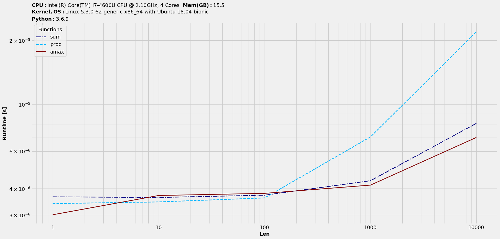
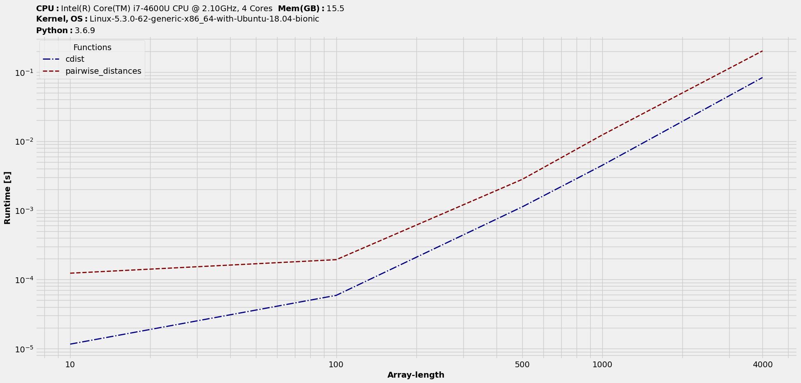

benchit (BENCHmark IT!)
=======================

|Py-Versions| |Py-LatestVersion| |GitHub-Releases| |PyPI-Downloads|  |GitHub-License|

Tools to benchmark Python solutions on runtime performance and visualize. Based on `timeit`, it primarily aims to functionally simulate the `timeit <https://ipython.readthedocs.io/en/stable/interactive/magics.html#magic-timeit>`__ behaviour and hence the name! This facilitates benchmarking on multiple datasets and solutions.

Documentation
-------------

|Docs|

Installation
------------

Latest PyPI stable release :

.. code:: sh

    pip install benchit

Pull latest development release on GitHub and install in the current directory :

.. code:: sh

    pip install -e git+https://github.com/droyed/benchit.git@master#egg=benchit

Getting started
^^^^^^^^^^^^^^^

Consider a setup to compare NumPy ufuncs - `sum <https://docs.scipy.org/doc/numpy/reference/generated/numpy.sum.html>`__, `prod <https://docs.scipy.org/doc/numpy/reference/generated/numpy.prod.html>`__, `max <https://docs.scipy.org/doc/numpy/reference/generated/numpy.amax.html>`__ on arrays varying in their sizes. To keep it simple, let's consider `1D` arrays. Thus, we would have :

.. code-block:: python

    >>> import numpy as np
    >>> funcs = [np.sum,np.prod,np.max]
    >>> inputs = [np.random.rand(i) for i in 10**np.arange(5)]

    >>> import benchit
    >>> t = benchit.timings(funcs, inputs)

It's a *dataframe-like* object and as such we can plot it. It automatically adds in specs into the title area to convey all of available benchmarking info :

.. code-block:: python

    >>> t.plot(logy=True, logx=True)

|readme_1_timings|

Realistic example-1 (Multiple arguments)
^^^^^^^^^^^^^^^^^^^^^^^^^^^^^^^^^^^^^^^^

Let's consider a setup where functions accept more than one argument. Let's take the case of computing `euclidean distances <https://en.wikipedia.org/wiki/Euclidean_distance>`__ between two `2D` arrays. We will feed in arrays with varying number of rows and 3 columns to represent data in 3D Cartesian coordinate system and benchmark two commonly used functions in Python.

.. code-block:: python

    >>> from sklearn.metrics.pairwise import pairwise_distances
    >>> from scipy.spatial.distance import cdist
    >>> fns = [cdist, pairwise_distances]

    >>> import numpy as np
    >>> in_ = {n:[np.random.rand(n,3), np.random.rand(n,3)] for n in [10,100,500,1000,4000]}
    >>> t = benchit.timings(fns, in_, multivar=True, input_name='Array-length')
    >>> t.plot(logx=True)

|readme_2_timings|

Realistic example-2 (Multiple arguments with groupings)
^^^^^^^^^^^^^^^^^^^^^^^^^^^^^^^^^^^^^^^^^^^^^^^^^^^^^^^

We will extend the previous example to make the second argument a variable too and study the trend as we vary the number of columns.

.. code-block:: python

    # Get benchmarking object (dataframe-like) and plot results
    >>> R = np.random.rand
    >>> in_ = {(n,W):[R(n,W), R(n,W)] for n in [10, 100, 500, 1000] for W in [3, 20, 50, 100]}
    >>> t = benchit.timings(fns, in_, multivar=True, input_name=['nrows', 'ncols'])
    >>> t.plot(logx=True, sp_ncols=2, sp_argID=0, sp_sharey='g')

For plotting, we are using number of rows as the x-axis base.

|readme_3_timings|

Quick Tips
----------

**1. Plotting on notebooks?**

Use `benchit.setparams(environ='notebook')` before plotting. Check out `sample notebook run <https://github.com/droyed/benchit/blob/master/docs/source/PlotDemo-NotebookEnv.ipynb>`__.

**2. Get a quick glance into the benchmarking trend before the actual one**

Use `benchit.setparams(rep=1)` before plotting. Then, use `benchit.setparams()` for a proper benchmarking.

**3. Get a quicker glance into plot layout and vague benchmarking trend before the actual one**

Use `benchit.setparams(timeout=1e-5, rep=1)` before plotting. Then, use `benchit.setparams()` for a proper benchmarking.

**4.  Working with multi-variable datasets to study trend w.r.t. each argument?**

Use nested loops to set-up input datasets as shown earlier. More information is available in documentation.

As a general rule, it's advisable to work on Python `3.6` or newer for better plotting experience.

.. |Docs| image:: https://readthedocs.org/projects/benchit/badge/?version=latest
    :target: https://benchit.readthedocs.io/en/latest/?badge=latest

.. |GitHub-License| image:: https://img.shields.io/github/license/droyed/benchit
   :target: https://github.com/droyed/benchit/blob/master/LICENSE

.. |GitHub-Releases| image:: https://img.shields.io/github/v/release/droyed/benchit
   :target: https://github.com/droyed/benchit/releases/latest

.. |PyPI-Downloads| image:: https://img.shields.io/pypi/dm/benchit.svg?label=pypi%20downloads&logo=PyPI&logoColor=white
   :target: https://pypi.org/project/benchit

.. |Py-LatestVersion| image:: https://img.shields.io/pypi/v/benchit.svg
   :target: https://pypi.org/project/benchit

.. |Py-Versions| image:: https://img.shields.io/pypi/pyversions/benchit.svg?logo=python&logoColor=white
   :target: https://pypi.org/project/benchit

