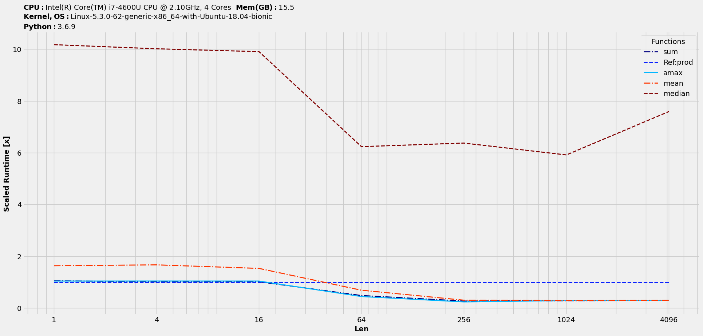
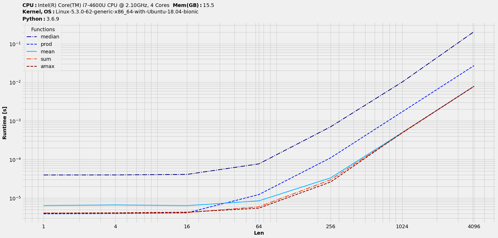
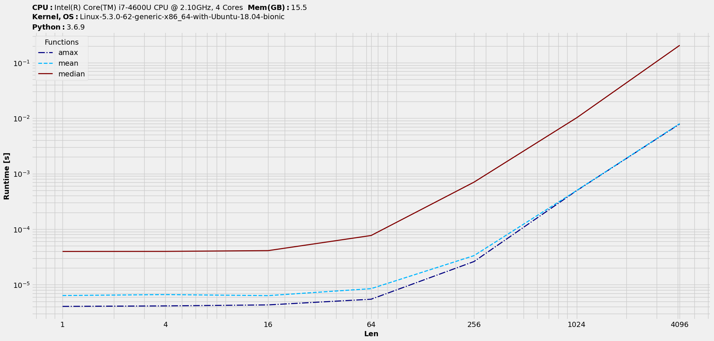
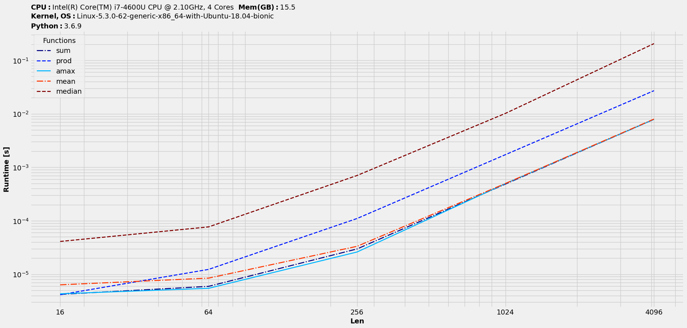

Features
========

Apart from getting the timings, we can further process the underlying data to study various aspects of the benchmarking.

Speedups & scaled-timings
-------------------------

Benchmarking results could be stored as two more datatypes with `BenchmarkObj`, namely `speedups` and `scaled_timings` (timings numbers simply scaled by one reference function). So, these alongwith the entry datatype of `timings` form the essential three datatypes of this package. All asssociated class methods and utility functions revolve around them.

Let's study the speedups of all w.r.t `prod` alongwith ranking :

.. code-block:: python

    >>> s = t.speedups(ref=1) # prod's location index in t is 1
    >>> s.plot(logy=False, logx=True, save='speedups_by_prod.png')

|speedups_by_prod|

Finally, the scaled-timings :

.. code-block:: python

    >>> st = t.scaled_timings(ref=1) # prod's location index in t is 1
    >>> st.plot(logy=False, logx=True, save='scaledtimings_by_prod.png')

|scaledtimings_by_prod|

The input argument to methods `speedups` and `scaled_timings` i.e. `ref` accepts three types of arguments for indexing - `int` as the location index, `str` as the function name string and `function` itself that was input into `funcs`.

Let's explore the other available tools with this package. As mentioned earlier, all of these are applicable to all the three datatypes with `BenchmarkObj`. We will re-use the numbers obtained with the  :ref:`Minimal workflow` discussed earlier.

Rank & reset_columns
--------------------

The order of the plot legend by default would be same as the order in `funcs` argument. With many competing solutions in `funcs`, for an easy correlation between them and the plot lines, we might want to sort the legend based on their performance and hence comes the idea of ranking. There are various criteria on which performance could be ranked. Let's explore the usage with the default one :

.. code-block:: python

    >>> t.rank()
    >>> t.plot(logy=True, logx=True, save='timings_ranked.png')

|timings_ranked|

Note that ranking would have changed the columns order. To revert to the original order, use :

.. code-block:: python

    >>> t.reset_columns()

Drop
----

Let's say we might want to focus on few functions and hence drop the others or even drop some input datasets. This method does the job, as we can drop by the column and index values. Note that this works in-place. So, if we want to drop `median` and `prod`, it would be :

.. code-block:: python

    >>> t.drop(['sum', 'prod'], axis=1)
    >>> t.plot(logy=True, logx=True, save='timings_dropfuncs.png')

|timings_dropfuncs|

To drop certain datasets (starting with original `t`) :

.. code-block:: python

    >>> t.drop([1,16], axis=0)
    >>> t.plot(logy=True, logx=True, save='timings_dropdata.png')

|timings_dropdata|

Copy
----

As the name suggests, we can make a copy of the benchmarking object with it. It should be useful when we are trying out stuffs and need a backup of benchmarking results.

Expose to pandas-world
======================

Earlier we saw how we can go back and forth between `benchit.BenchmarkObj` and `pandas.DataFrame`. We also studied how that could be used to extend plot functionality. In this section, let's study how we can extend it to manipulate benchmarking results. We will continue with the hands-on method of explanation.

General syntax
--------------

For a given benchmarking object `t`, the general syntax on working with the underlying dataframe would be something like this :

.. code-block:: python

    >>> df = t.to_dataframe()
    >>> df_new = # some operation on df to result in a new dataframe, df_new
    >>> benchit.bench(df_new, dtype=t.dtype)

Examples
--------

We will take over from :ref:`Minimal workflow` with the `timings` plot and look at few cases. For reference, the timings plot looked something like this :

|timings|

Crop
^^^^

As an example, just to emphasize on the ease to do this *business*, a typical way of dropping the first two datasets would be :

.. code-block:: python

    >>> benchit.bench(t.to_dataframe().iloc[2:],dtype=t.dtype)

Default `dtype` argument for `benchit.bench` is set for `timings`. So, it becomes simpler with :

.. code-block:: python

    >>> benchit.bench(t.to_dataframe().iloc[2:]).plot(logx=True, save='timings_cropdata.png')

|timings_cropdata|

Combine
^^^^^^^

Back to the same `Minimal benchmarking workflow`, let's say we want to see the combined timings for two functions and how would it fare against other individual functions. `Dataframe` format makes it easy :

.. code-block:: python

    # Create a new column with combined data
    >>> df['sum+amax'] = df['sum'] + df['amax']

    # Create a new function-column with combined data and plot
    >>> benchit.bench(df).plot(logx=True, save='timings_comb.png')

|timings_comb|

At least one interesting observation could be made there. If we compare combined one of `sum & max` against `prod`, the former wins on lower timings only with larger datasets.

Earlier listed :ref:`Drop` is based on this strategy of working with the inherent dataframe data. There are endless possibilities and scenarios where having a dataframe data could be useful and necessary!

.. |timings| image:: timings.png
.. |speedups_by_prod| image:: speedups_by_prod.png

.. |timings_dropdata| image:: timings_dropdata.png

.. |timings_comb| image:: timings_comb.png
