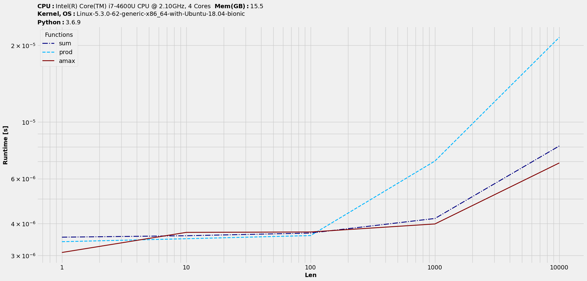

Benchit Documentation
======================

.. note::

  This package is under active development. API changes are very likely.

Installation
------------

Latest PyPI stable release (alongwith dependencies) :

.. code:: sh

    pip install benchit

Pull latest development release on GitHub and install in the current directory :

.. code:: sh

    pip install -e git+https://github.com/droyed/benchit.git@master#egg=benchit

Dependencies
-------------
- `cpuinfo <https://pypi.org/project/py-cpuinfo/>`__
- `matplotlib <https://matplotlib.org/>`__
- `numpy <https://numpy.org/>`__
- `pandas <https://pandas.pydata.org/>`__
- `psutil <https://pypi.org/project/psutil/>`__
- `tqdm <https://pypi.org/project/tqdm/>`__
- `ipython <https://pypi.org/project/ipython/>`__

Quick start
-----------

Let's benchmark NumPy ufuncs - `sum <https://docs.scipy.org/doc/numpy/reference/generated/numpy.sum.html>`__, `prod <https://docs.scipy.org/doc/numpy/reference/generated/numpy.prod.html>`__, `max <https://docs.scipy.org/doc/numpy/reference/generated/numpy.amax.html>`__ on `1D` arrays -

.. code-block:: python

    # Setup input functions and datasets
    >>> import numpy as np
    >>> funcs = [np.sum,np.prod,np.max]
    >>> inputs = [np.random.rand(i) for i in 10**np.arange(5)]

    # Benchmark and plot
    >>> import benchit
    >>> t = benchit.timings(funcs, inputs)
    >>> t.plot(logy=True, logx=True, save='index_timings.png')

|index_timings|

Though these perform entirely different operations, it was meant to showcase a basic usage. For a detailed explanation on the usage and more realistic scenarios, jump over to - :doc:`workflow`.

Benchit - Contents
------------------

.. toctree::

   intro
   workflow
   features
   realistic_cases
   plot
   changes
   benchit

Appendix
--------

* :ref:`genindex`
* :ref:`modindex`

