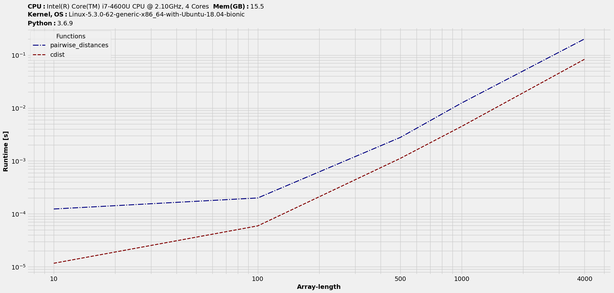

Real-world examples
===================

We will take few realistic scenarios and also study how arguments could be setup differently.

Multiple arg
------------

Adding arrays
^^^^^^^^^^^^^

We will study a multiple argument case. This was inspired by `a Stack Overflow question <https://stackoverflow.com/questions/57024802/>`__ on adding two arrays. We will study the case of functions that accept two arguments. The two functions in consideration are :

.. code-block:: python

    def new_array(a1, a2):
        a1 = a1 + a2

    def inplace(a1, a2):
        a1 += a2

These accept NumPy array data and thus would perform those summations and write-back in a vectorized way. The first one does summation stores in temporary buffers and then pushes back the result to a new memory space, while the second method writes back the addition result to first array's memory space. We are investigating, which one's better and by how much. Let's put them to the test using our tools!

Now, as mentioned earlier, for multiple argument cases, we need to feed in each of those input datasets as a tuple each. We could setup the inputs as a list. But, let's setup in a dictionary, so that datasets are assigned labels with its keys. Let's get the timings and hence plot them :

.. code-block:: python

    >>> R = np.random.rand
    >>> inputs = {(i,i):(R(i,i),R(i,i)) for i in 2**np.arange(3,13)}
    >>> t = benchit.timings([new_array,inplace], inputs, multivar=True, input_name='Array-shape')
    >>> t.plot(logy=True, logx=False, save='multivar_addarrays_timings.png')

|multivar_addarrays_timings|

Looking at the plot, we can conclude that the `write-back` one is better for larger arrays, which makes sense given its memory efficiency.

Euclidean distance
^^^^^^^^^^^^^^^^^^

Single variable
"""""""""""""""

We will study another multiple argument case. The setup involves `euclidean distances <https://en.wikipedia.org/wiki/Euclidean_distance>`__ between two `2D` arrays. We will feed in arrays with varying number of rows and 3 columns to represent data in 3D Cartesian coordinate system and benchmark two commonly used functions in Python.

.. code-block:: python

    # Setup input functions
    >>> from sklearn.metrics.pairwise import pairwise_distances
    >>> from scipy.spatial.distance import cdist
    >>> fns = [pairwise_distances, cdist]
    
    # Setup input datasets
    >>> import numpy as np
    >>> in_ = {n:[np.random.rand(n,3), np.random.rand(n,3)] for n in [10,100,500,1000,4000]}
    
    # Get benchmarking object (dataframe-like) and plot results
    >>> t = benchit.timings(fns, in_, multivar=True, input_name='Array-length')
    >>> t.plot(save='multivar_euclidean_timings.png')
    
|multivar_euclidean_timings|

Multivar-groupings
^^^^^^^^^^^^^^^^^^

We will simply extend previous test-case to cover for the second argument to the distance functions, i.e. with varying number of columns. We will re-use most of that earlier setup.

Also, we will explore subplot specific arguments available with `plot`. These are marked with prefix as : `sp_`, short for `subplot_`.

.. code-block:: python

    >>> R = np.random.rand
    >>> in_ = {(n,W):[R(n,W), R(n,W)] for n in [10, 100, 500, 1000] for W in [3, 5, 8, 10, 20, 50, 80, 100]}
    >>> t = benchit.timings(fns, in_, multivar=True, input_name=['nrows', 'ncols'])
    >>> t.plot(logx=True, sp_ncols=2, sp_argID=0, sp_sharey='g', save='multigrp_id0_euclidean_timings.png')
    >>> t.plot(logx=True, sp_ncols=2, sp_argID=1, sp_sharey='g', save='multigrp_id1_euclidean_timings.png') 

Grouping based on `argID = 0` :

|multivar_euclidean_timings_grp0|

Grouping based on `argID = 1` :

|multivar_euclidean_timings_grp1|

No argument
-----------

Random sampling
^^^^^^^^^^^^^^^

Finally, there might be cases when input functions have external no argument required. To create one such scenario, let's consider a setup where we compare `numpy.random.choice <https://numpy.org/doc/stable/reference/random/generated/numpy.random.choice.html>`__ against `random.sample <https://docs.python.org/3/library/random.html#random.sample>`__ to get samples without replacement. We will consider an input data of `1000,000` elements and use those functions to extract `1000` samples. We will test out `random.sample` with two kinds of data - array and list, while feeding only array data to `numpy.random.choice`. Thus, in total we have three solutions, as listed in the full benchmarking shown below :

.. code-block:: python

    # Global inputs
    import numpy as np
    ar = np.arange(1000000)
    l = ar.tolist()
    sample_num = 1000
    
    # Setup input functions with no argument
    # NumPy random choice on array data
    def np_noreplace():
        return np.random.choice(ar, sample_num, replace=False)
    
    from random import sample
    
    # Random sample on list data
    def randsample_on_list():
        return sample(l, sample_num)
    
    # Random sample on array data
    def randsample_on_array():
        return sample(ar.tolist(), sample_num)
    
    # Benchmark
    t = benchit.timings(funcs=[np_noreplace, randsample_on_list, randsample_on_array])
    >>> t                                                                                                                                                                                                              
    Functions  np_noreplace  randsample_on_list  randsample_on_array
    Case                                                            
    NoArg           0.02528            0.000653             0.033294

One interesting observation there - With array data `numpy.random.choice` is slightly better than `random.sample`. But, if we allow the flexibility of choosing between list and array data, `random.sample` turns the table in a big way. That's the whole point with benchmarking, which is to get insights into how different modules compare on the same functionality and how different data formats affect those runtime numbers. This in turn, should help the end-user decide on choosing methods depending on the available setup.

.. |multivar_addarrays_timings| image:: multivar_addarrays_timings.png

