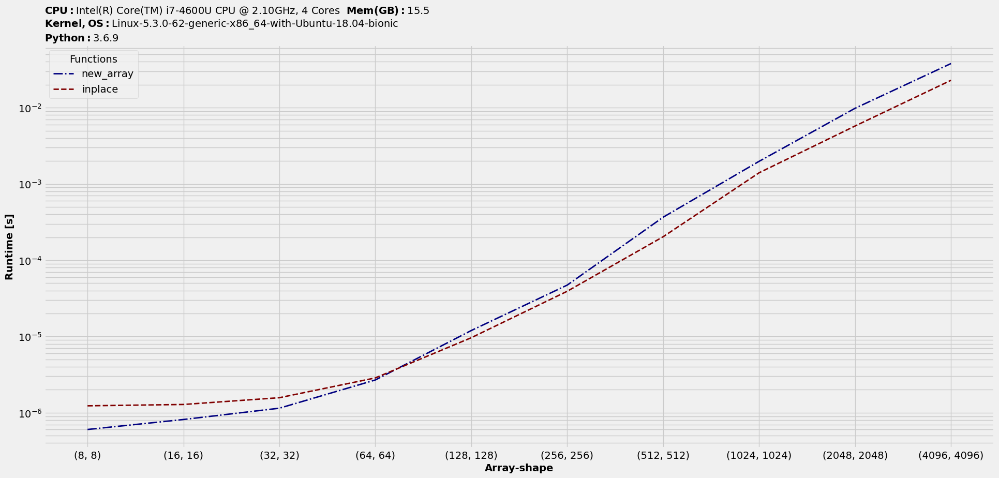

******************
Usage and examples
******************

Rest of this section will use the module's methods. So, let's import it once -

.. code-block:: python

    import benchit

Getting specifications
======================

This package is mainly focused on generating benchmarking numbers and plots. This will be demonstrated with the help of use-cases later. To start off, as a good benchmarking workflow, we might want to gather the system configuration. That's helpful in reproducing or even making sense of those numbers across different systems. We have a function in this package to do the same - `print_specs`.

Show specs :

.. code-block:: python

    >>> benchit.print_specs()
    CPU : Intel(R) Core(TM) i7-4600U CPU @ 2.10GHz, 4 Cores
    Memory (GB) : 15.5
    ByteOrder : Little
    Kernel-OS : Linux-5.3.0-42-generic-x86_64-with-Ubuntu-18.04-bionic
    Python : 3.6.8

Show specs with modules info :

.. code-block:: python

    >>> benchit.print_specs(benchit.extract_modules_from_globals(globals()))
    CPU : Intel(R) Core(TM) i7-4600U CPU @ 2.10GHz, 4 Cores
    Memory (GB) : 15.5
    ByteOrder : Little
    Kernel-OS : Linux-5.3.0-42-generic-x86_64-with-Ubuntu-18.04-bionic
    Python : 3.6.8
    Python Module(s) : 
        Benchit : 0.0.1
        Numpy : 1.17.2

Examples
========

For most cases, we just need to feed in two inputs to benchmarking function, `benchit.timings` - List of functions and list or dictionary of input datasets. The output is a table (a pandas dataframe) with the runtimes of each of those functions against each of the datasets. Dataframe has been the design choice, as it supports plotting directly from it, being one of the methods and relevant information could be stores as headers and `name` methods.

Single arg : NumPy ufuncs
-------------------------

We will study a case of single argument with default parameters. To give it a clearer picture, let's take a sample case where we try to benchmark three NumPy ufuncs - `sum <https://docs.scipy.org/doc/numpy/reference/generated/numpy.sum.html>`__, `prod <https://docs.scipy.org/doc/numpy/reference/generated/numpy.prod.html>`__, `max <https://docs.scipy.org/doc/numpy/reference/generated/numpy.amax.html>`__ on arrays varying in their sizes. To keep it simple, let's consider `1D` arrays. Thus, we would have :

.. code-block:: python

    >>> import numpy as np
    >>> funcs = [np.sum,np.prod,np.max]
    >>> inputs = [np.random.rand(i) for i in 10**np.arange(5)]

    >>> t = benchit.timings(funcs, inputs)
    >>> t
    Functions       sum      prod      amax
    Len                                    
    1          0.000004  0.000004  0.000003
    10         0.000004  0.000004  0.000004
    100        0.000004  0.000004  0.000004
    1000       0.000004  0.000007  0.000004
    10000      0.000008  0.000022  0.000007

It's a *dataframe-like* object and as such we can plot it. It automatically adds in specs into the title area to convey all of available benchmarking info :

.. code-block:: python

    >>> t.plot(logy=True, logx=True, savepath='case1_timings.png')

Depending on `matplotlib.style` in use (this one's using style - `fivethirtyeight`), the resultant plot would look something like this :

|plot1|

The timings plot shows `prod` being slower than other two. Let's see how much better are those two w.r.t `prod` :

.. code-block:: python

    >>> s = t.speedups(ref_func_by_index=1) # prod's index in t is 1
    >>> s.plot(logy=False, logx=True, savepath='case1_speedups_by_prod.png')

|plot2|

Multiple arg : Adding arrays
-----------------------------

We will study a multiple argument case. This was inspired by `a stackoverflow question <https://stackoverflow.com/questions/57024802/>`__ on adding two arrays. We will study the case of functions that accept two arguments. The two functions in consideration are :

.. code-block:: python

    def func1(a1, a2):
        a1 = a1 + a2

    def func2(a1, a2):
        a1 += a2

These accept NumPy array data and thus would perform those summations and write-back in a vectorized way. The first one does summation stores in temporary buffers and then pushes back the result to `a1`, while the second method directly writes back. We are investigating, which one's better and by how much. Let's put them to the test using our tools!

Now, as mentioned earlier, for multiple argument cases, we need to feed in each of those input datasets as a tuple each. We could setup the inputs as a list. But, let's setup in a dictionary, so that datasets are assigned labels with its keys. Let's get the timings and hence plot them :

.. code-block:: python

    >>> R = np.random.rand
    >>> inputs = {str((i,i)):(R(i,i),R(i,i)) for i in 2**np.arange(3,13)}
    >>> t = benchit.timings([func1,func2], inputs, multivar=True, input_name='Array-shape')
    >>> t.plot(logy=True, logx=False, savepath='case2_timings.png')

|plot3|

Looking at the plot, we can draw conclusions on performance between `func1` and `func2` across different datasets.

Multiple arg : Euclidean distances
----------------------------------

We will study another multiple argument case. The setup involves `euclidean distances <https://en.wikipedia.org/wiki/Euclidean_distance>`__ between two `2D` arrays. We will feed in arrays with varying number of rows and 3 columns to represent data in 3D Cartesian coordinate system and benchmark two commonly used functions in Python.

.. code-block:: python

    # Setup input functions
    >>> from sklearn.metrics.pairwise import pairwise_distances
    >>> from scipy.spatial.distance import cdist
    >>> fns = [cdist, pairwise_distances]
    
    # Setup input datasets
    >>> import numpy as np
    >>> in_ = {(n,3):[np.random.rand(n,3), np.random.rand(n,3)] for n in [10,100,500,1000,4000]}
    
    # Get benchmarking object (dataframe-like) and plot results
    >>> t = benchit.timings(fns, in_, multivar=True)
    >>> t.plot(savepath='test_multivar_euclidean_output.png')
    
|plot4|

No arg : Random sampling
------------------------

Finally, there might be cases when input functions have external no argument required. To create one such scenario, let's consider a setup where we compare NumPy's `random.choice` against random's `sample` to get samples without replacement. We will consider a input data of `1000,000` elements and use those functions to extract `1000` samples.

.. code-block:: python

    # Global inputs
    import numpy as np
    ar = np.arange(1000000)
    l = ar.tolist()
    sample_num = 1000
    
    # Setup input functions with no argument
    # NumPy random choice on array data
    def np_noreplace():
        return np.random.choice(ar, sample_num, replace=False)
    
    from random import sample
    
    # Random sample on list data
    def randsample_on_list():
        return sample(l, sample_num)
    
    # Random sample on array data
    def randsample_on_array():
        return sample(ar.tolist(), sample_num)
    
    # Benchmark
    t = benchit.timings(funcs=[np_noreplace, randsample_on_list, randsample_on_array])
    >>> t                                                                                                                                                                                                              
    Functions  np_noreplace  randsample_on_list  randsample_on_array
    Case                                                            
    NoArg          0.031296            0.000745             0.037702

One interesting observation there - NumPy's sampling function works well with array data, but is slower than random's one when the latter is fed a list data. That's the whole point with benchmarking, which is to get insights into how different modules compare on the same functionality and how different data formats affect those runtime numbers. This in turn, should help the end-user decide on choosing methods depending on the available setup.

.. |plot1| image:: singlevar_numpy_ufuncs_timings.png
.. |plot2| image:: singlevar_numpy_ufuncs_speedups_by_prod.png

.. |plot4| image:: multivar_euclidean_timings.png
