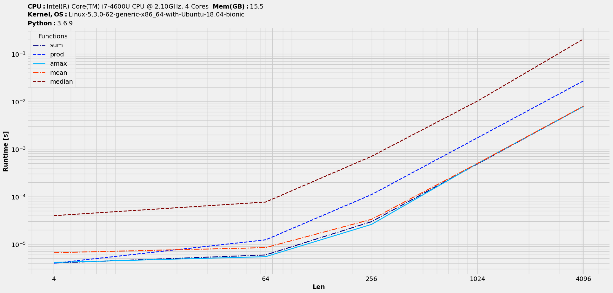
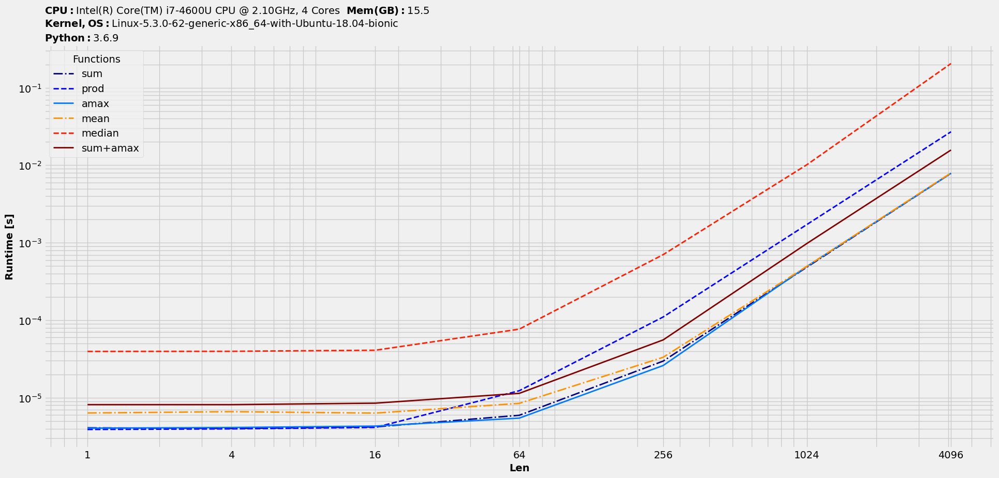

Benchmarking steps
==================

A minimal workflow employing this package would basically involve three steps :

* Setup functions : A list or dictionary of functions to be benchmarked. It supports both single and multiple arguments.
* Setup datasets : A list or dictionary of datasets to be benchmarked.
* Benchmark to get timings in a dataframe-like object. Each row holds one dataset and each header represents one function each. Dataframe has been the design choice, as it supports plotting directly from it and additionally benchmarking setup information could be stored as name values for index and columns.

We will study these with the help of a sample setup in :ref:`Minimal workflow`.

.. note::

  Prior to Python 3.6, dictionary keys are not maintained in the order they are inserted. So, when working with those versions and with input dataset being defined as a dictionary, to keep the order, `collections.OrderedDict <https://docs.python.org/2/library/collections.html#collections.OrderedDict>`__ could be used.

To get more out of it, we could optionally do the following :

* Plot the timings.
* Get speedups or scaled-timings of all functions with respect to one among them.
* Rank the functions based on various performance-metrics.

A detailed study with examples in the next section should clear up things.

We will try to take a hands-on approach and explore the features available with this package. We will start off with the minimal steps to benchmarking on a setup and then explore other utilities to cover most common features.

Rest of the documentation will use the module's methods. So, let's import it once -

.. code-block:: python

    >>> import benchit

Minimal workflow
================

We will study a case of single argument with default parameters. Let's take a sample case where we try to benchmark the five most common NumPy ufuncs - `sum <https://numpy.org/doc/stable/reference/generated/numpy.sum.html>`__, `prod <https://numpy.org/doc/stable/reference/generated/numpy.prod.html>`__, `max <https://numpy.org/doc/stable/reference/generated/numpy.amax.html>`__, `mean <https://numpy.org/doc/stable/reference/generated/numpy.mean.html>`__, `median <https://numpy.org/doc/stable/reference/generated/numpy.median.html>`__ on arrays varying in their sizes. To keep it simple, let's consider `1D` arrays. Thus, the benchmarking steps would look something like this :

.. code-block:: python

    >>> import numpy as np
    >>> funcs = [np.sum,np.prod,np.max,np.mean,np.median]
    >>> inputs = [np.random.rand(i,i) for i in 4**np.arange(7)]
    >>> t = benchit.timings(funcs, inputs)
    >>> t
    Functions       sum      prod      amax      mean    median                                                                                                                                                        
    Len                                                                                                                                                                                                                
    1          0.000005  0.000004  0.000005  0.000007  0.000046
    4          0.000005  0.000004  0.000005  0.000007  0.000047
    16         0.000005  0.000005  0.000005  0.000007  0.000049
    64         0.000007  0.000014  0.000007  0.000009  0.000094
    256        0.000035  0.000131  0.000030  0.000038  0.000845
    1024       0.000511  0.002050  0.000512  0.000522  0.011525
    4096       0.008208  0.032582  0.008257  0.008274  0.261838

It's a *dataframe-like* object, called `BenchmarkObj`. We can plot it, which automatically adds in system configuration into the title area to convey all the available benchmarking information :

.. code-block:: python

    >>> t.plot(logy=True, logx=True, save='timings.png')

Resultant plot would look something like this :

|timings|

These `4` lines of codes would be enough for most of the benchmarking workflows.

Speedups & scaled-timings
-------------------------

Benchmarking results could be stored as two more datatypes with `BenchmarkObj`, namely `speedups` and `scaled_timings` (timings numbers simply scaled by one reference function). So, these alongwith the entry datatype of `timings` form the essential three datatypes of this package. All asssociated class methods and utility functions revolve around them.

Let's study the speedups of all w.r.t `prod` alongwith ranking :

.. code-block:: python

    >>> s = t.speedups(ref_func_by_index=1) # prod's index in t is 1
    >>> s.plot(logy=False, logx=True, save='speedups_by_prod.png')

|speedups_by_prod|

Finally, the scaled-timings :

.. code-block:: python

    >>> st = t.scaled_timings(1) # prod's index in t is 1
    >>> st.plot(logy=False, logx=True, save='scaledtimings_by_prod.png')

|scaledtimings_by_prod|

Features
========

Let's explore the other available tools with this package. As mentioned earlier, all of these are applicable to all the three datatypes with `BenchmarkObj`. We will re-use the numbers obtained with the  :ref:`Minimal workflow` discussed earlier.

Rank & reset_columns
--------------------

The order of the plot legend by default would be same as the order in `funcs` argument. With many competing solutions in `funcs`, for an easy correlation between them and the plot lines, we might want to sort the legend based on their performance and hence comes the idea of ranking. There are various criteria on which performance could be ranked. Let's explore the usage with the default one :

.. code-block:: python

    >>> t.rank()
    >>> t.plot(logy=True, logx=True, save='timings_ranked.png')

|timings_ranked|

Note that ranking would have changed the columns order. To revert to the original order, use :

.. code-block:: python

    >>> t.reset_columns()

Drop
----

Let's say we might want to focus on few functions and hence drop the others or even drop some input datasets. This method does the job, as we can drop by the column and index values. Note that this works in-place. So, if we want to drop `median` and `prod`, it would be :

.. code-block:: python

    >>> t.drop(['sum', 'prod'], axis=1)
    >>> t.plot(logy=True, logx=True, save='timings_dropfuncs.png')

|timings_dropfuncs|

To drop certain datasets (starting with original `t`) :

.. code-block:: python

    >>> t.drop([1,16], axis=0)
    >>> t.plot(logy=True, logx=True, save='timings_dropdata.png')

|timings_dropdata|

Copy
----

As the name suggests, we can make a copy of the benchmarking object with it. It should be useful when we are trying out stuffs and need a backup of benchmarking results.

Extract dataframe & construct back
----------------------------------

The underlying benchmarking data is stored as a pandas dataframe that could be extracted with :

.. code-block:: python

    >>> df = t.to_dataframe()

There's a benchmarking object construct function `benchit.bench` that accepts dataframe alongwith `dtype`. So, we can do the constructing step in two ways :

.. code-block:: python

    >>> t = benchit.bench(df, dtype=t.dtype)

Expose to pandas-world
======================

Earlier we saw how we can go back and forth between `benchit.BenchmarkObj` and `pandas.DataFrame`. Let's see how this process of exposing the benchmarking data to pandas domain might be more than just helpful. We will continue with the hands-on method of explanation.

General syntax
--------------

For a given benchmarking object `t`, the general syntax on working with the underlying dataframe would be something like this :

.. code-block:: python

    >>> df = t.to_dataframe()
    >>> df_new = # some operation on df to result in a new dataframe, df_new
    >>> benchit.bench(df_new, dtype=t.dtype)

Examples
--------

We will take over from :ref:`Minimal workflow` with the `timings` plot and look at few cases. For reference, the timings plot looked something like this :

|timings|

Crop
^^^^

As an example, just to emphasize on the ease to do this *business*, a typical way of dropping the first two datasets would be :

.. code-block:: python

    >>> benchit.bench(t.to_dataframe().iloc[2:],dtype=t.dtype)

Default `dtype` argument for `benchit.bench` is set for `timings`. So, it becomes simpler with :

.. code-block:: python

    >>> benchit.bench(t.to_dataframe().iloc[2:]).plot(logx=True, save='timings_cropdata.png')

|timings_cropdata|

Combine
^^^^^^^

Back to the same `Minimal benchmarking workflow`, let's say we want to see if combine two functions in a solution, how would it fare against other individual functions? `Dataframe` format makes it easy :

.. code-block:: python

    # Create a new column with combined data
    >>> df['sum+amax'] = df['sum'] + df['amax']

    # Create a new function-column with combined data and plot
    >>> benchit.bench(df).plot(logx=True, save='timings_comb.png')

|timings_comb|

At least one interesting observation could be made there. If we compare combined one of `sum & max` against `prod`, the former wins on lower timings only with larger datasets.

Earlier listed :ref:`Drop` is based on this strategy of working with the inherent dataframe data. There are endless possibilities and scenarios where having a dataframe data could be useful and necessary!

.. |timings| image:: timings.png

.. |scaledtimings_by_prod| image:: scaledtimings_by_prod.png
.. |timings_ranked| image:: timings_ranked.png
.. |timings_dropfuncs| image:: timings_dropfuncs.png

.. |timings_cropdata| image:: timings_cropdata.png

